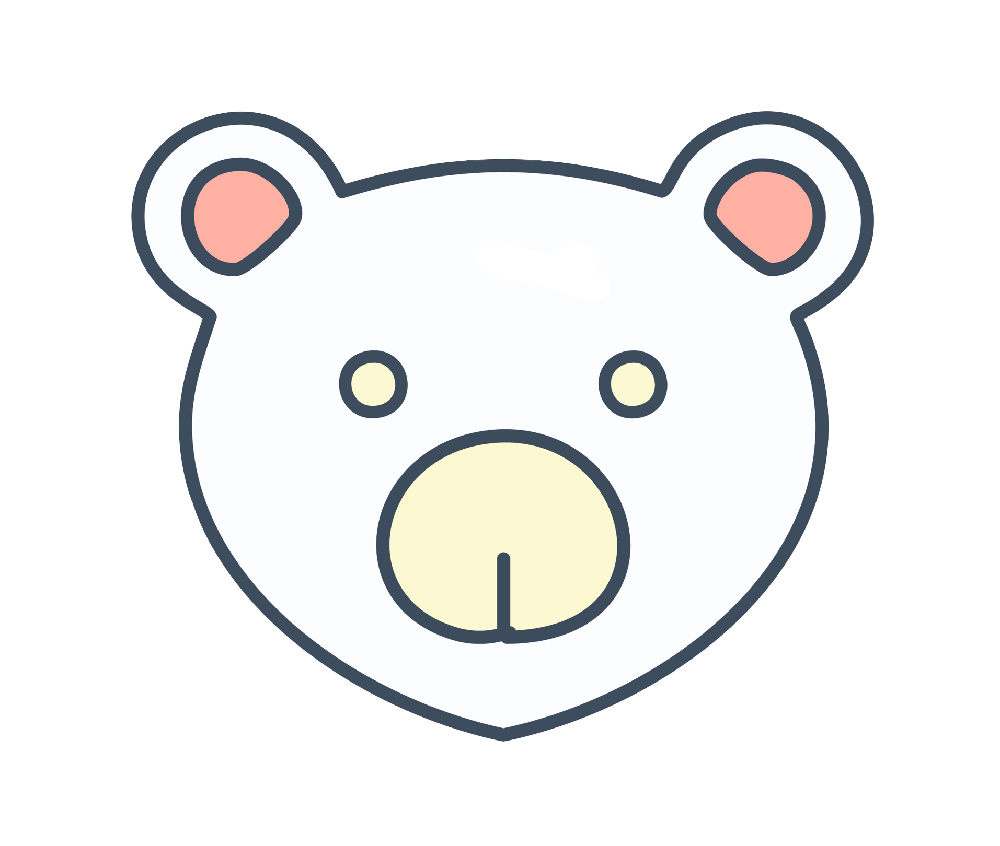

# Memo Discord Bot

<div align="center">
  
  
  [](LICENSE)
  [](https://github.com/your-username/Memo-bot/releases)
  [](https://www.python.org/downloads/)
  [](https://github.com/DisnakeDev/disnake)
</div>

## Overview

Memo Bot is a versatile Discord bot designed to enhance server management and user interaction. From moderation tools to fun commands, Memo Bot provides a comprehensive suite of features to improve your Discord server experience.

### Key Features

- 🛡️ **Server Moderation**
  - Kick/Ban management
  - User timeouts
  - Voice channel controls
  - Nickname management

- 🎵 **Voice Features**
  - YouTube music playback
  - Text-to-speech (TTS)
  - Voice channel controls

- 🔧 **Utility Commands**
  - User profiles
  - Server statistics
  - Character information lookup
  - Language translation

- 🎮 **Fun Commands**
  - Random quotes
  - Dad jokes
  - Coin flips
  - And more!

## Quick Start

1. **Installation**
   ```bash
   # Clone the repository
   git clone https://github.com/your-username/Memo-bot.git
   cd Memo-bot

   # Install dependencies
   pip install -r requirements.txt

   # Set up the database
   python setup/create_feedback_table.py
   python setup/create_history_table.py
   python setup/create_usage_table.py
   ```

2. **Configuration**
   - Create a `config.json` file in the project root:
   ```json
   {
       "defaults": {
           "prefix": "?",
           "footer_text": "Your footer text",
           "footer_icon": "Your footer icon URL"
       },
       "bot_version": "0.4.7",
       "bot_name": "Memo",
       "tts_mode": "fast",
       "log_channel_id": "YOUR_LOG_CHANNEL_ID"
   }
   ```

3. **Launch**
   ```bash
   python -B launcher.py --token YOUR_BOT_TOKEN
   ```

## Commands

Here's a quick overview of the main commands:

### Moderation
- `?kick @user [reason]` - Kick a user
- `?ban @user [reason]` - Ban a user
- `?timeout @user <duration> <unit> [reason]` - Timeout a user
- `?mute @user [reason]` - Server mute a user
- `?deafen @user [reason]` - Server deafen a user

### Voice & Music
- `?play [youtube_url]` - Play music from YouTube
- `?tts [text]` - Convert text to speech
- `?join` - Join voice channel
- `?leave` - Leave voice channel

### Utility
- `?profile @user` - View user profile
- `?server` - View server info
- `?translate [text]` - Translate text to English
- `?charinfo [character]` - Get character information

### Fun
- `?joke` - Get a random dad joke
- `?quote` - Get quote of the day
- `?coin` - Flip a coin

For a complete list of commands, use `?help` in Discord.

## Project Structure

```
Memo-bot/
├── assets/               # Bot assets (logos, emojis)
├── db_manager/          # Database management modules
├── setup/               # Database setup scripts
├── src/                # Main bot source code
│   ├── bot.py         # Core bot implementation
│   └── utils/         # Utility functions
├── temp/               # Temporary files
├── website/            # Bot website files
├── config.json         # Bot configuration
├── launcher.py         # Bot launcher
├── LICENSE            # Apache 2.0 license
└── README.md          # Project documentation
```

## Development

### Requirements
- Python 3.8 or higher
- Discord Developer Account
- Required Python packages (see requirements.txt)

### Core Dependencies
- disnake
- gTTS
- yt_dlp
- rich
- click
- deep-translator
- pillow

### Contributing
1. Fork the repository
2. Create your feature branch (`git checkout -b feature/AmazingFeature`)
3. Commit your changes (`git commit -m 'Add some AmazingFeature'`)
4. Push to the branch (`git push origin feature/AmazingFeature`)
5. Open a Pull Request

## Support

- [Documentation](https://memo.nerd-bear.org/docs)
- [Issue Tracker](https://github.com/your-username/Memo-bot/issues)
- [Discord Support Server](https://discord.gg/your-invite)
- Email: support@nerd-bear.org

## License

This project is licensed under the Apache License 2.0 - see the [LICENSE](LICENSE) file for details.

## Acknowledgments

- [DisnakeDev](https://github.com/DisnakeDev/disnake) for the Discord API wrapper
- All contributors who have helped improve Memo Bot

## Authors

- **Nerd Bear** - *Initial work and maintenance* - [nerd-bear](https://github.com/nerd-bear)

---

<div align="center">
  <strong>Made with ❤️ by Nerd Bear</strong><br>
  © 2024 Memo Bot. All rights reserved.
</div>
